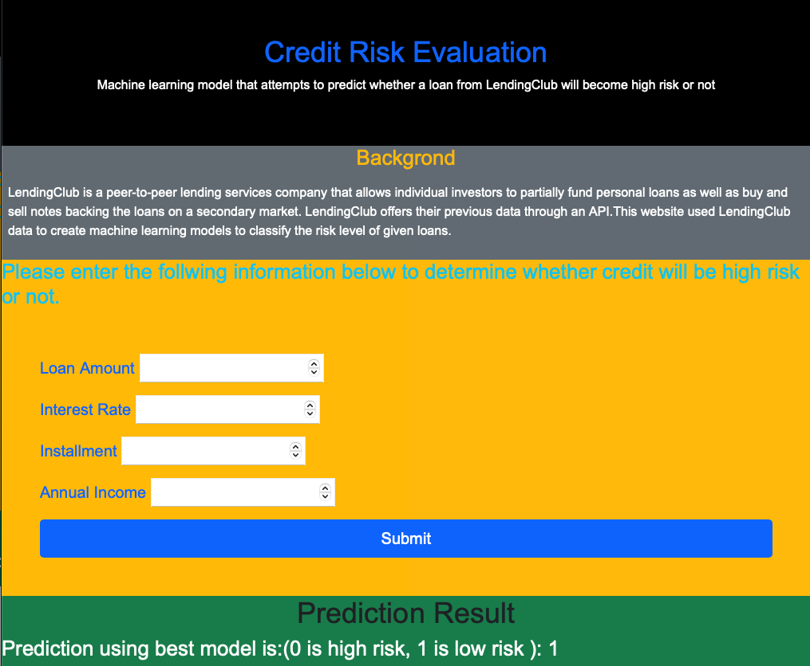

# Predicting Credit Risk
The website is deployed to Heroku at: https://pred-credit-risk.herokuapp.com/

In this project, I built a machine learning model that attempts to predict whether a loan from LendingClub will become high risk or not.

## Background
LendingClub is a peer-to-peer lending services company that allows individual investors to partially fund personal loans as well as buy and sell notes backing the loans on a secondary market. LendingClub offers their previous data through an API.I have used LendingClub data to create machine learning models to classify the risk level of given loans.

## Data Source
LendingClub (2019-2020) _Loan Stats_. Retrieved from: [https://resources.lendingclub.com/](https://resources.lendingclub.com/)
https://resources.lendingclub.com/LoanStats_2019Q1.csv.zip
https://resources.lendingclub.com/LoanStats_2019Q2.csv.zip
https://resources.lendingclub.com/LoanStats_2019Q3.csv.zip
https://resources.lendingclub.com/LoanStats_2019Q4.csv.zip
https://resources.lendingclub.com/LoanStats_2020Q1.csv.zip

Used an entire year's worth of data (2019) to predict the credit risk of loans from the first quarter of the next year (2020).

## Data cleaning
After downloading the data, I needed to clean it up so that it was usable for our model. I made the following changes using pandas:

* Removed rows with nan values
* Concanated all the four quatar data in one using pd.concat
* Selected only important columns
* Converted interest rate to numerical
* Converted the target column values to low_risk and high_risk based on their values
* Selected only low risk and high risk rows
* Created  and saved under-sampling data for modeling
* Created  and saved over-sampling data for modeling
* Performed similar operation for test data also

## Under Sampling and Over Sampling
In the original dataset, only 2.2% of loans are categorized as high risk. To get a truly accurate model, special techniques were used on imbalanced data.
1. Under Sampling: These data have been undersampled to give an even number of high risk and low risk loans using undersampling techniques.   
2. over Sampling: Oversampling and SMOTE (Synthetic Minority Over-sampling ) technique is  used to give an even number of high risk and low risk loans.  

## Preprocessing: 
### Scaling the data
Used `StandardScaler` to scale the training and testing sets. 
### Converting categorical data to numeric
Created a training set from the 2019 loans using `pd.get_dummies()` to convert the categorical data to numeric columns. Similarly, create a testing set from the 2020 loans, also using `pd.get_dummies()`

## Model Building
Created different classification models on this data. Different models are:
* Logistic Regression
* KNeighbors Classifier
* Support Vector Classifier
* Decision Tree Classifier
* Random Forest Classifier
* Extremely Random Trees
* Boosting- AdaBoostClassifier

## Tuning hyperparamaters for all model
* Grid Search CV
* Randomized Search CV

## Trying to improve score by selecting important features 
Using SelectFromModel to fit the Adaboster Classifier model and get the important features only to fit all the model desceribed above.

## Model Performance

### Model Performance after selecting only important features

## Comparing real and predicted value using different value for sample test set

## Productionization
Used Flask templating to create a new HTML page that predict the credit risk with the best model. The model was saved using pickle module.

Created a different route that take the user input and predict the credit risk with the best model.

The website is deployed to Heroku at: https://pred-credit-risk.herokuapp.com/

