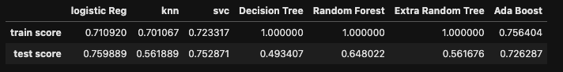
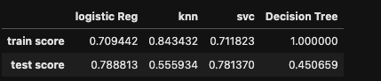

# Predicting Credit Risk

In this project I have built a machine learning model that attempts to predict whether a loan from LendingClub will become high risk or not.

## Background
LendingClub is a peer-to-peer lending services company that allows individual investors to partially fund personal loans as well as buy and sell notes backing the loans on a secondary market. LendingClub offers their previous data through an API.I have used LendingClub data to create machine learning models to classify the risk level of given loans.

## Data Source
LendingClub (2019-2020) _Loan Stats_. Retrieved from: [https://resources.lendingclub.com/](https://resources.lendingclub.com/)
https://resources.lendingclub.com/LoanStats_2019Q1.csv.zip
https://resources.lendingclub.com/LoanStats_2019Q2.csv.zip
https://resources.lendingclub.com/LoanStats_2019Q3.csv.zip
https://resources.lendingclub.com/LoanStats_2019Q4.csv.zip
https://resources.lendingclub.com/LoanStats_2020Q1.csv.zip

Used an entire year's worth of data (2019) to predict the credit risk of loans from the first quarter of the next year (2020).

## Data cleaning
After downloading the data, I needed to clean it up so that it was usable for our model. I made the following changes using pandas:

* Parsed numeric data out of salary
* Removed rows without salary
* Parsed rating out of company text
* Made a new column for company state
* Added a column for if the job was at the company’s headquarters
* Transformed founded date into age of company
* Made columns for if different skills were listed in the job description:

## Under Sampling and Over Sampling
In the original dataset, only 2.2% of loans are categorized as high risk. To get a truly accurate model, special techniques were used on imbalanced data.
1. Under Sampling: These data have been undersampled to give an even number of high risk and low risk loans using undersampling techniques.   
2. over Sampling: Oversampling and SMOTE (Synthetic Minority Over-sampling ) technique is  used to give an even number of high risk and low risk loans.  

## Preprocessing: 
### Scaling the data
Used `StandardScaler` to scale the training and testing sets. 
### Converting categorical data to numeric
Created a training set from the 2019 loans using `pd.get_dummies()` to convert the categorical data to numeric columns. Similarly, create a testing set from the 2020 loans, also using `pd.get_dummies()`

## Model Building
Created different classification models on this data. Different models are:
### Stochastic Gradent Descent Classifier
### KNeighbors Classifier
### Support Vector Classifier
### Decision Tree Classifier
### Random Forest Classifier
### Extremely Random Trees
### Boosting- AdaBoostClassifier

## Tuning hyperparamaters using Grid Search CV

## Tuning hyperparamaters using Randomized Search CV

## Trying to improve score by selecting important features 
USing SelectFromModel to fit the Adaboster Classifier model and get the important features only to fit all the model desceribed above.

## Model Performance
* Stochastic Gradent Descent Classifier
* KNeighbors Classifier
* Support Vector Classifier
* Decision Tree Classifier
* Random Forest Classifier
* Extremely Random Trees
* Boosting- AdaBoostClassifier

### Model Performance after selecting only important features
* Stochastic Gradent Descent Classifier
* KNeighbors Classifier
* Support Vector Classifier
* Decision Tree Classifier
* Random Forest Classifier
* Extremely Random Trees
* Boosting- AdaBoostClassifier

## Comparing real and predicted value using different value for sample test set

## Productionization

